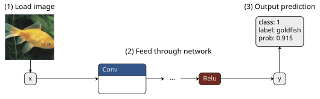

# Tiny C++ Inference Engine

A lightweight CPU inference engine for ResNet and similar computer vision models. Written in pure C++ using Eigen for
fast matrix operations.



## Features

* Supports all operations required for models like ResNet or VggNet
* Use pretrained TorchScript models: Python script converts to custom format
* RGB images: reads png and jpg images (using stb_image.h)
* Easy to read & hack: perfect to understand how inference works under the hood

## Performance

* Compiles in a few seconds
* Binary <1MB
* Runs ResNet18 in 65ms (vs Torch in 25ms) on Intel i5-10400 @ 2.90GHz

## Quick start

The demo runs ResNet18 on ImageNet images. Make sure to run all commands from the root level of the repository.

### Export pretrained ResNet18

Convert the pretrained TorchVision model to the custom model format. The model gets stored in the folder `model/`.

```python export_resnet.py```

You need numpy, onnx, torch and torchvision installed.

### Build demo

Build the binary from the C++ code. You need [Eigen](https://libeigen.gitlab.io/) installed.

```
cmake -B build -DCMAKE_BUILD_TYPE=Release
cmake --build build --config Release
```

### Run demo

Two ImageNet samples are provided. Run the binary using the exported model (in model/) and the sample images (in data/):

```build/tiny_inference_engine model/ data/```

Expected output:

```
OP=Identity|OUT=x|ARG=__INPUT__ [DEL]
OP=Conv|OUT=getitem|ARG=x conv1.weight conv1.weight_bias 3 2 
OP=Relu|OUT=relu|ARG=getitem
...
OP=Identity|OUT=__OUTPUT__|ARG=linear [DEL]
Model loading: 24ms
--------------------
Warmup run, inference: class=308
Measuring inference time
--------------------
Sample: fly_224x224
Predicted: class=308 label=fly
Prob: 0.670702
--------------------
...
--------------------
Sample: goldfish_224x224
Predicted: class=1 label=goldfish
Prob: 0.915123
--------------------
Runtime per sample: 66ms
```

## Technical Insights

### How it works

* A pretrained TorchVision model is converted to ONNX (with static shapes)
* The ONNX model is used to export the graph structure (model.txt) and the parameters (*.bin)
* Topological sorting computes the "flat" sequence of operations (model.txt)
* The graph structure file and parameter files are loaded in C++ and internally the model graph is recreated with the
  operations as nodes
* All intermediate tensors (including input and output) are stored in a map
* Inference simply means applying one operation at a time, reading its input, and writing its output tensor
* The Model class puts a wrapper around all of this, takes the input tensor, and returns the output tensor

### Performance bottlenecks

The biggest bottleneck is the Conv2d operation. The naive implementation was slow due bad memory access patterns
(jumping around in memory - a lot of cache misses). Here some of the changes that helped the most:

* Improving access patterns and avoiding recomputing array indices (using raw data pointers instead)
* Sharding (splitting work across multiple threads) into groups of channels
* Switching to a matrix multiplication based Conv2d implementation
* Letting Eigen deal with matrix multiplication
* Enable aggressive compiler settings, especially compile for the current CPU architecture

Overall, this brought ResNet18 runtime down from 300ms to 65ms per sample. Also, other tweaks helped, but overall Conv2d
was the biggest bottleneck.

## Benchmark

Comparison of this tiny inference engine with Torch. In both cases the models are warmed up before measuring the
runtime. CPU: Intel i5-10400 @ 2.90GHz.

| Model    | Tiny Inf Eng [ms] | Torch [ms] |
|:---------|:-----------------:|:----------:| 
| ResNet18 |        65         |     25     |
| ResNet34 |        120        |     40     |
| ResNet50 |        150        |     60     |
